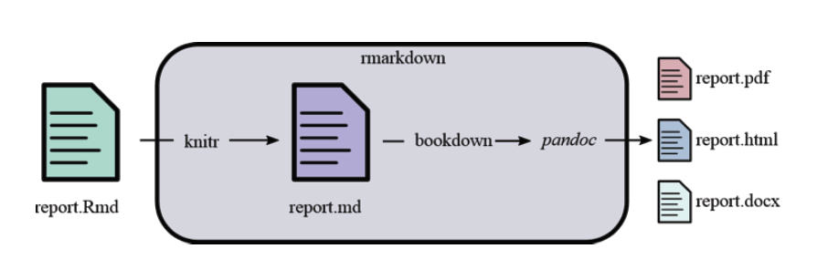

# Preambulo

## Quien soy?

Gabriel Muñoz 

- Biólogo
- Ecólogo Computacional 

Consultor en Datos 
*Biodiversidad y Geoespaciales*

Coordinador General 


## Charla introductoria 

https://github.com/fgabriel1891/ManejoHabilDatosMediaLab 

## Material taller día 1

https://github.com/fgabriel1891/ManejoHabilDatosWorkshop

## Material este taller

https://github.com/fgabriel1891/ManejoHabilDatosDia2

## Contacto 

Gabriel Muñoz 

- fgabriel1891@gmail.com
- nasua.research@gmail.com
- 0960809080
- /fgabriel1891 (GitHub)


# Markdown y reportes reproducibles



Maarkdown es un lenguaje simple, pero poderoso para crear publicaciones. Facil sintaxis que permite el formato y la inclusión de links, imagenes, referencias, en el texto. 

## Por que usar Rmarkdown? 

R Markdown te permite integrar tu codigo y flujo de analisis con texto escrito en sintaxis markdown.  Esto asegura que tus análisis sean reproducibles, interactivos, compartibles y agradables de visualizar al momento de reportar. Al mismo tiempo reduce el tiempo ocupado en escribir y **Formatear** reporters. Tareas manuales como enumerar figuras, bibliografía, formatos de tablas son ahora automatizadas. Empiezas a escribir el reporte al tiempo que haces tus análisis. 

**Esta presentación fue hecha en Markdown**

## Por que usar Rmarkdown? 

Markdown soporta no solo R, pero tambien otros lenguajes

Python: 

```{python}
print 'Hello, world. This is Python:'
import sys
print(sys.version) # Python version
```


## Por que usar Rmarkdown? 

R  

```{r}
print("Hello, world. This is R")
version
```

En resumen: 

$$ Markdown + R + Bookdown =  Reports (Dynamic + Reliable ) $$ 

## Ejercicio práctico 1

### Crear nuevo proyecto 
### Abrir nuevo documento markdown 

```{r, eval = F}
install.packages(c("rmarkdown", "knitr")
```


## Ejercicio práctico 1

### YAML 

- html_document
- pdf_document
- word_document
- html_slides

templates! 

## Ejercicio práctico 1

- Sintax básica en markdown 

```{r, eval = F}

- *italica*
- **negrita**
- `codigo`
- [hipervinculos](www.google.com)
- etc. 


Una ecuación: $A = \sin(x)^2*log(a)+25^{2}$

Una imagen: `!(https://4.bp.blogspot.com/-NMLkPoHJvCc/VrB2UbBKFjI/AAAAAAAAChQ/SxLw2F7pP-U/s1600/Copypaste0.jpg)`
```


## Ejercicio práctico


```{r, eval = F}
"# indican niveles de indexación"

"#" Titulo
"##" Subtitulo
### Sub-subtítulo 

```

## Ejercicio práctico

chunk de codigo "ctrl + alt + i"

## Ejercicio práctico

Tablas en Markdown 

```{r, eval = F}


|Item 1| a|b|c|
|------|---|---|---|
|opt1|x|x|x|
|opt2|x|x|x| 
  
```


## Ejercicio práctico

camera_dataset.csv desde el repositorio GitHub 
eval = FALSE, echo = FALSE

```{r}
cameraDataset = read.csv("data/camera_dataset.csv", header = T)

summary(cameraDataset)
```


## Ejercicio práctico

```{r, eval = F}
par(las = 1)
plot(Effective.pixels~Price, 
     cameraDataset,
     ylab = "Pixeles",
     xlab = "Precio",
     pch = 16,
     col = "red")
points(Effective.pixels~Price, 
       cameraDataset[cameraDataset$Release.date <= "2000",],
       col = "black",
       pch = 16)

### Modelos lineares 
lm = lm(Effective.pixels~Price, 
        cameraDataset)
lmPre = lm(Effective.pixels~Price,
           cameraDataset[cameraDataset$Release.date <= "2000",])
lmPost = lm(Effective.pixels~Price, 
            cameraDataset[cameraDataset$Release.date >= "2000",])
####### 


abline(lm, col = "green")
abline(v = 2000)
abline(lmPre, lty = 1, col = "black")
abline(lmPost, lty = 1, col = "red")
legend("topright", legend = c("pre 2000", 
                              "post:2000"),
       pch = 16, col = c("black","red"))
legend("topleft", legend = c("linear model (all data)", 
                             "linear model pre 2000",
                             "linear model post 2000"),
       lty = 1, col = c("green", "red", "black"))
```

## Ejercicio práctico

```{r, echo = F}
par(las = 1)
plot(Effective.pixels~Price, cameraDataset,
     ylab = "Pixeles",
     xlab = "Precio",
     pch = 16,
     col = "red")
points(Effective.pixels~Price, cameraDataset[cameraDataset$Release.date <= "2000",],
       col = "black",
       pch = 16)

### Modelos lineares 
lm = lm(Effective.pixels~Price, cameraDataset)
lmPre = lm(Effective.pixels~Price, cameraDataset[cameraDataset$Release.date <= "2000",])
lmPost = lm(Effective.pixels~Price, cameraDataset[cameraDataset$Release.date >= "2000",])
####### 


abline(lm, col = "green")
abline(v = 2000)
abline(lmPre, lty = 1, col = "black")
abline(lmPost, lty = 1, col = "red")
legend("topright", legend = c("pre 2000", "post:2000"),
       pch = 16, col = c("black","red"))
legend("topleft", legend = c("linear model (all data)", "linear model pre 2000", "linear model post 2000"),
       lty = 1, col = c("green", "red", "black"))
```


## Ejercicio práctico


```{r, eval = F}
par(las = 1)
plot( Weight..inc..batteries.~Price, 
      cameraDataset,
     ylab = "Peso",
     xlab = "Precio",
     pch = 16,
     col = "red")
points( Weight..inc..batteries.~Price, 
        cameraDataset[cameraDataset$Dimensions <= "101",],
       col = "black",
       pch = 16)

### Modelos lineares 
lm = lm( Weight..inc..batteries.~Price, 
         cameraDataset)
lmMenos = lm( Weight..inc..batteries.~Price,
            cameraDataset[cameraDataset$Dimensions <= "101",])
lmMas = lm( Weight..inc..batteries.~Price, 
             cameraDataset[cameraDataset$Dimensions >= "101",])
####### 


abline(lm, col = "green")
abline(lmMenos, lty = 1, col = "black")
abline(lmMas, lty = 1, col = "red")
legend("topright", legend = c("menos 101", "mas 101"),
       pch = 16, col = c("black","red"))
legend("topleft", legend = c("linear model (all data)", "linear menos 101", "linear mas 101"),
       lty = 1, col = c("green", "red", "black"))
```


## Ejercicio práctico


```{r, echo = F}
par(las = 1)
plot( Weight..inc..batteries.~Price, cameraDataset,
     ylab = "Peso",
     xlab = "Precio",
     pch = 16,
     col = "red")
points( Weight..inc..batteries.~Price, cameraDataset[cameraDataset$Dimensions <= "101",],
       col = "black",
       pch = 16)

### Modelos lineares 
lm = lm( Weight..inc..batteries.~Price, cameraDataset)
lmPre = lm( Weight..inc..batteries.~Price, cameraDataset[cameraDataset$Dimensions <= "101",])
lmPost = lm( Weight..inc..batteries.~Price, cameraDataset[cameraDataset$Dimensions >= "101",])
####### 


abline(lm, col = "green")
abline(lmPre, lty = 1, col = "black")
abline(lmPost, lty = 1, col = "red")
legend("topright", legend = c("menos 101", "mas 101"),
       pch = 16, col = c("black","red"))
legend("topleft", legend = c("linear model (all data)", "linear menos 101", "linear mas 101"),
       lty = 1, col = c("green", "red", "black"))
```


## Ejercicio práctico

### Crear un reporte basado en este análisis 

fig.align 
out.width 

# Shiny 

## Ejemplos 

- https://shiny.rstudio.com/gallery/


## Nueva aplicación! 

- File -> New File -> Shiny Web App

- Abre (app.R / ui.R, server.R) click runApp 

- Cerrar con el simbolo de stop 

## Nueva aplicación! 

- Localmente

- Servidor 

## Anatomía de la applicación web con shiny

```{r, eval = F}
install.packages("shiny")
library(shiny)
# user interface
ui <- fluidPage()

# servidor 
server <- function(input, output){}

shinyApp( ui, server)
```

inputs y outputs! https://shiny.rstudio.com/reference/shiny/1.0.5/


## User interfase

```{r, eval = F}

library(shiny)
library(ggplot2)
cameraDataset = read.csv("data/camera_dataset.csv", header = T)

ui = fluidPage( 
  h1("Camera explorer"),
  # Sidebar layout 
  sidebarLayout(
    sidebarPanel ( 
    # Inputs "Seleccionar variables para graficar"
    # eje y
    selectInput(inputId = "y", label = "Y -axis",
                choices = c("Release.date",
                            "Max.resolution","Low.resolution",
                            "Effective.pixels Zoom.wide..W.",
                            "Zoom.tele..T.",   "Normal.focus.range", "Macro.focus.range",
                            "Storage.included","Weight..inc..batteries.",   "Dimensions"),
                selected = "Price"),
    # eje x
    selectInput(inputId = "x", label = "X -axis",
                choices = c("Release.date",
                            "Max.resolution","Low.resolution",
                            "Effective.pixels Zoom.wide..W.",
                            "Zoom.tele..T.",   "Normal.focus.range", "Macro.focus.range",
                            "Storage.included","Weight..inc..batteries.",   "Dimensions"),
                selected = "Max.resolution"),
    
    ),
  # Output
  
  mainPanel(
    plotOutput("scatterplot")
  )
  )
  
  
)

```


## Server

```{r}
server = function(input, output){ 
  output$scatterplot = renderPlot({
    ggplot(data = cameraDataset, aes_string(x = input$x, y = input$y)) + 
      geom_point() 
    abline(line())
  })
  
}

```

## Construir la aplicación

shiny::shinyApp(ui, server)

## Widgets gallery

https://shiny.rstudio.com/gallery/widget-gallery.html


## Deploy 

http://www.shinyapps.io/

## Abrir en la web 

## Gracias! 

https://rstudio.github.io/learnr/


## Contacto 

Gabriel Muñoz 

- fgabriel1891@gmail.com
- nasua.research@gmail.com
- 0960809080
- /fgabriel1891 (GitHub)


